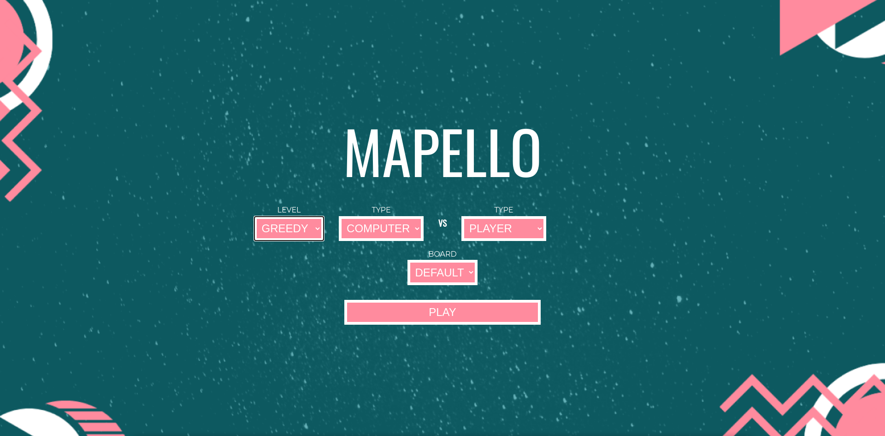

<h3 align="center">

A fun *Reversi* derivative board game for 2 players
</h3>
<h4 align="center">Made with WebGL and Prolog</h4>

----

## Description

The goal of this project was to develop a human-like environment to play a browser version of a board game. 

The board game elected was [Mapello](docs/MAPELLO_EN.pdf) and the tech behind this project consists of: 
* a [backend](backend/) game engine powered by the logic programming language **Prolog**.

* a [frontend](frontend/) environment created with the WebGL technology, entirely written in **JavaScript**.

----

## Demo

----

## Run

To run this project, first ensure you have `Docker` and `docker-compose` installed.

A [Sicstus](https://sicstus.sics.se/download4.html) license for the Prolog development system is also needed. Download the Linux version, apply your license and copy the `sicstus` folder installation (with this name) inside the `backend` folder of this project.

After that, run:

* `docker-compose up -d` to build up the project containers and start them.
  * When both of the containers have been created, go to `http://0.0.0.0:8080` in your browser and start playing.
* `docker-compose down` to stop the containers.

----

## Mapello Rules

In the Mapello game, for two players, **the pieces used are black and white reversible discs**, with the color facing up identifying a player's piece. 

The board, with a **10x10 square configuration,** is delimited by walls, and the playable area corresponds to the center of the board, 8x8. **Two pieces of each player are placed in the four central cells**, in a diagonal pattern. 

On the board, there are also other pieces of each of the following types: 
* **walls**, extra and immovable, in any position of the playable area; 
* **bonuses**, placed in the playable area and rewarding, with 3 points, the player who plays on them; 
* **jokers**, acting as the current player's pieces, which exist only on the edges, outside the playable area. 

**The players play alternately**, with the black player starting. **On each turn, the player places a piece on an empty space, or bonus, adjacent to an opponent's piece.** 

**The opponent's pieces that are continuously between the new piece and another piece of the current player, or a joker, either diagonally, vertically, or horizontally, are turned upside down to the current player's color.** 

**A valid move must cause at least one of the opponent's pieces to be flipped.** If the player cannot make a valid move, he passes the turn to his opponent. 

**The game ends when neither player has a valid move.** When it ends, the points are counted by adding the number of each player's pieces present on the board to their accumulated bonuses, and the player with the most points wins.

----

## Game Instructions

### Start Menu

> Choosing Players and Board:

1. To choose the players' types, select *Player* or *Computer* from the *Type* dropdown menus.
2. To choose the difficulty level, in case the player is a *Computer*, select *Random* or *Greedy* from the *Level* dropdown menu. 
3. Select the type of the generated board in the *Board* dropdown menu - *Random* or *Default*.
4. Press **Play** to start the game

### Interface

> Cameras, Themes, Lights, Undo and Replay:

In the interface you can select the active camera, theme and lights. In addition, there are Undo and Replay buttons for the respective functions.

### How to play

> Piece selection and user interaction throughout the game:

* The scoreboard indicates which player must play and each player's points (bonus).
* The player has 60 seconds to play, and if not, the game is over.
* To play, the player whose color is indicated on the marker board can choose any piece on the auxiliary board by clicking on it.
* When choosing a piece, the valid positions are highlighted.
* To play the piece, simply click on one of the highlighted positions.
* The turn passes to the next player and the points will be updated if any bonuses are captured.
* At any time during the game, the player can Undo the play, going back to the previous move, or Replay to see all the moves made so far.
* When there are no more valid moves for any player, the game ends and the totals can be seen on the scoreboard, as well as the winner.

----

## Screenshots

|  |  |
|----|----|
|  |  |

----

## Authors

| Name             | E-Mail               |
| ---------------- | ---------------------|
| Diana Freitas    | up201806230@fe.up.pt |
| Eduardo Brito    | up201806271@fe.up.pt |